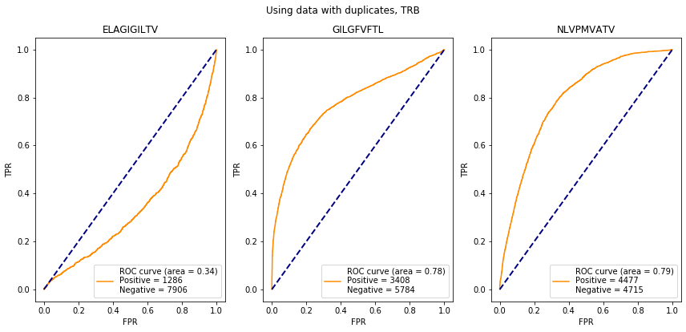
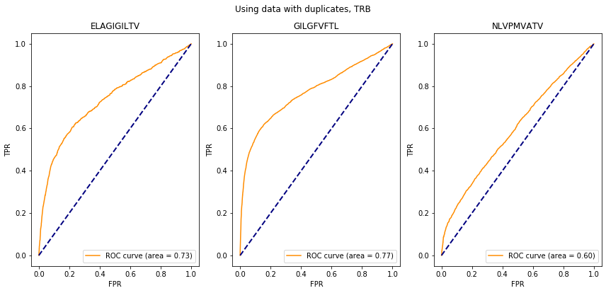
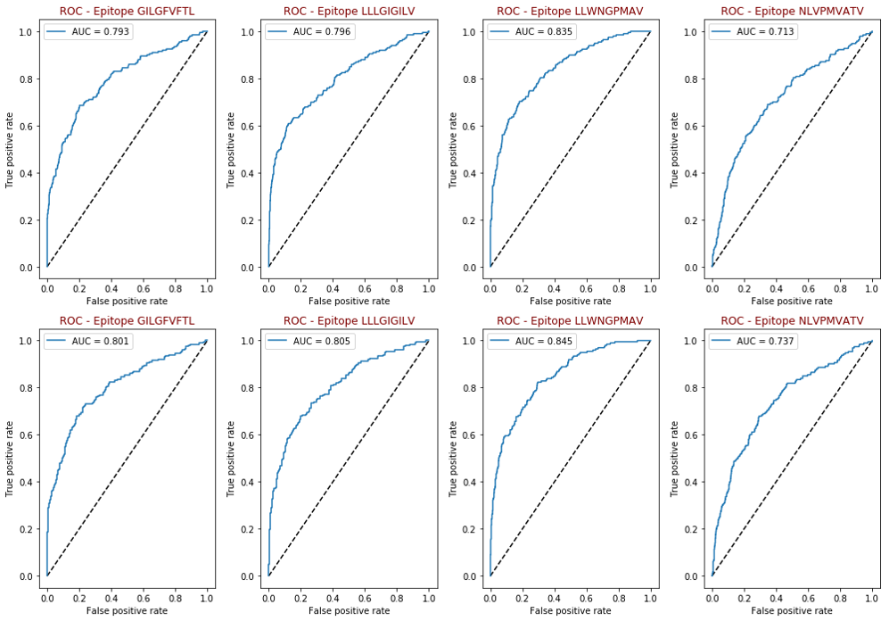

# TCR-classifiers benchmark pipeline

## Our goal
The analysis of T-cell receptor sequences of an individual allows us to determine, which pathogens and viruses his immune system can detect. The main challenge here is the uncertain matching between receptors and antigens. The TCR sequences of different lengths and amino acid content can be complementary to the same antigen.  
The goal of this project is to develop an efficient pipeline to compare the existing methods of the TCR prediction methods.
We also hypothesize, that usage of custom substitution matrices assembled from TCR sequences, instead of BLOSUM, can improve performance of antigen prediction.

### Supported algorithms
For now we support the following algorithms:
1) [GLIPH](https://www.nature.com/articles/nature22976)
2) [TCRdist](https://www.ncbi.nlm.nih.gov/pmc/articles/PMC5616171/)
3) [netTCR](https://www.biorxiv.org/content/10.1101/433706v1)
4) [pMTnet](https://github.com/tianshilu/pMTnet)

Pipelines for these algorithms are provided as **Jupyter notebooks** and are placed in the folders corresponding to their names.

### Substitution matrices
Except for the BLOSUM62 substitution matrix, we also provide substitution matrices, which are based on the TCRs receptors sequences (both for alpha-and beta-chains, and single antigens). The main pipeline of building matrices locates [here](https://github.com/antigenomics/vdjdb-classifier-benchmark/tree/master/cdr3_substitutions/CDR3_Substitutions.ipynb) in Jupyter format.
The precalculated matrices are placed [here](https://github.com/antigenomics/vdjdb-classifier-benchmark/tree/master/cdr3_substitutions/matrices).

## Data
We test all of the methods on [VDJ-database](https://vdjdb.cdr3.net/) (a curated database of T-cell receptor sequences of known antigen specificity).

## System requirements
We use **Python** with **Jupyter notebook**.  
To recreate the results of the study you need to pull master branch. Please take a look at requirements files as they contain versions of packages required to run the code.  
The code can be run on any OS. As modules that perform computations are well-commented you can add required functionality with little effort. This is also helpful if you want to look what is under the hood of result calculation.  
Please note as some algorithms use neural networks, speed of computation depends on whether you have a Cuda device.

## Usage
Then open `.ipynb` file in a folder with a name of the algorithm you are interested in. The input to all pipelines is a set of epitopes for which prediction is tested and training data.  
To **compare algorithm performance** to other ones it is convenient to use AUC calculated for a set of epitopes with ROC for visualization.   

## Results
Results of algorithm comparison consist of ROC plot for each epitope and calculated AUC on test set. Plots and data can be found in the end of `.ipynb` file for each algorithm.  
###### netTCR results

###### pMTnet results

###### TCRdist results with BLOSUM and custom substitution matrix
For TCRdist we also used our own substitution matrices:
* the first row represents the results with BLOSUM
* the second row - with our substitution matrices  

On average AUC grows by 1.5%.

## Authors
* Alexandra Ovsyannikova, National Research Nuclear University MEPHI
* Olga Nedilchenko, National Research University of Technology Bauman Moscow State Technical University
 
## Acknowledgments
We want to express gratitude to:
* Mikhail Shugay for constant support and for providing us with data for the research.  
* [Bioinformatics Institute](https://bioinf.me/en) for organizational assistance